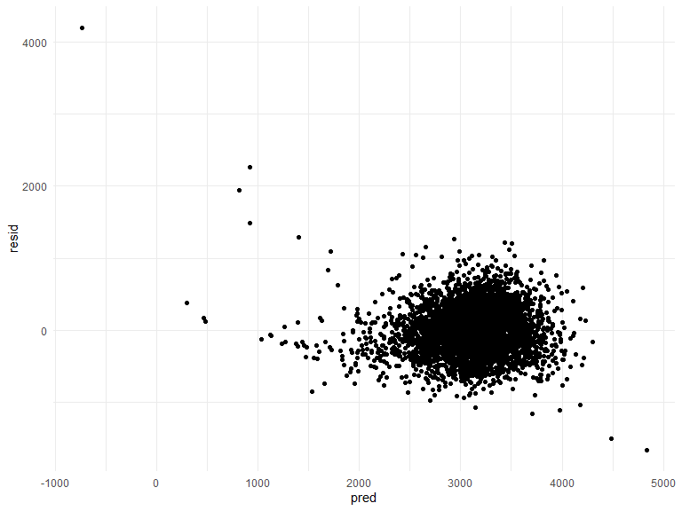
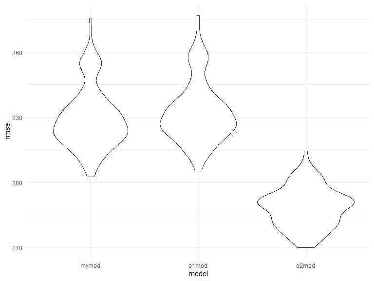

p8105\_hw6\_kq2127
================
Kristal Quispe
11/24/2019

# Problem 1

Load and clean the data set

``` r
bw_df =
  read_csv("./data/birthweight.csv") %>% 
  janitor::clean_names()%>% 
  mutate (
    babysex = as.factor(babysex),
    frace = as.factor(frace),
    malform = as.factor(malform),
    mrace = as.factor(mrace))
```

    ## Parsed with column specification:
    ## cols(
    ##   .default = col_double()
    ## )

    ## See spec(...) for full column specifications.

Fitting my model

``` r
my_model = lm(bwt ~ fincome + gaweeks + blength, data = bw_df)
```

Plot of Model Residuals against fitted values

``` r
bw_df %>% 
  modelr::add_residuals(my_model) %>% 
  modelr::add_predictions(my_model) %>% 
  ggplot(aes(x = pred, y = resid)) + 
  geom_point()
```



Other models

``` r
o1_model = lm(bwt ~ blength + gaweeks, data = bw_df)
o2_model = lm(bwt ~ bhead + blength + babysex + bhead * blength + bhead * babysex + blength * babysex + bhead * blength * babysex, data = bw_df)
```

Comparing other model

``` r
cv_df = 
  crossv_mc(bw_df, 100) %>% 
  mutate(
    train = map(train, as_tibble),
    test = map(test, as_tibble))
```

``` r
cv_results = 
  cv_df %>% 
  mutate(
    my_mod = map(.x = train, ~lm(bwt ~ fincome + gaweeks + blength, data = .x)),
    o1_mod = map(.x = train, ~lm(bwt ~ blength + gaweeks, data = .x)),
    o2_mod =  map(.x = train, ~lm(bwt ~ bhead + blength + babysex + bhead * blength + bhead * babysex + blength * babysex + bhead * blength * babysex, data = .x)),
    rmse_mymod = map2_dbl(.x = my_mod, .y = test, ~rmse(.x, .y)),
    rmse_o1mod = map2_dbl(.x = o1_mod, .y = test, ~rmse(.x, .y)),
    rmse_o2mod = map2_dbl(.x = o2_mod, .y = test, ~rmse(.x, .y))
  )
```

Visualize the root mean square error for the models

``` r
cv_results %>% 
  select(starts_with("rmse")) %>% 
  pivot_longer(
    everything(),
    names_to = "model", 
    values_to = "rmse",
    names_prefix = "rmse_") %>% 
  mutate(model = fct_inorder(model)) %>% 
  ggplot(aes(x = model, y = rmse)) + geom_violin()
```



# Problem 2

``` r
weather_df = 
  rnoaa::meteo_pull_monitors(
    c("USW00094728"),
    var = c("PRCP", "TMIN", "TMAX"), 
    date_min = "2017-01-01",
    date_max = "2017-12-31") %>%
  mutate(
    name = recode(id, USW00094728 = "CentralPark_NY"),
    tmin = tmin / 10,
    tmax = tmax / 10) %>%
  select(name, id, everything())
```

    ## Registered S3 method overwritten by 'crul':
    ##   method                 from
    ##   as.character.form_file httr

    ## Registered S3 method overwritten by 'hoardr':
    ##   method           from
    ##   print.cache_info httr

    ## file path:          C:\Users\kriqu\AppData\Local\rnoaa\rnoaa\Cache/ghcnd/USW00094728.dly

    ## file last updated:  2019-10-02 16:18:47

    ## file min/max dates: 1869-01-01 / 2019-09-30
