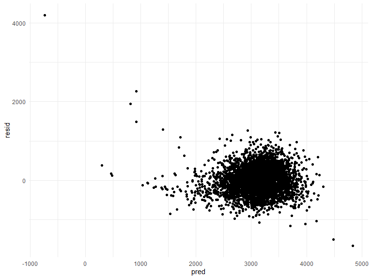
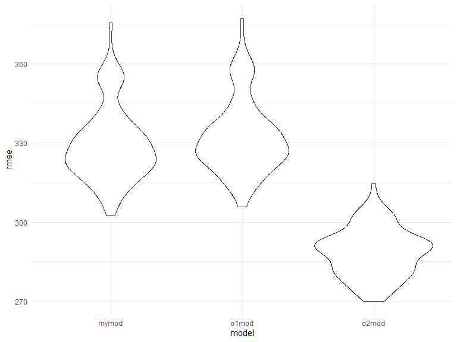
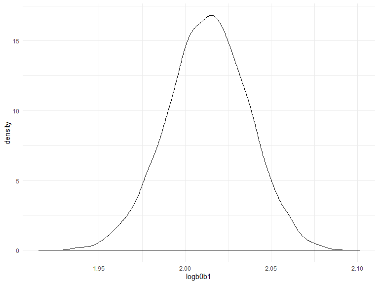
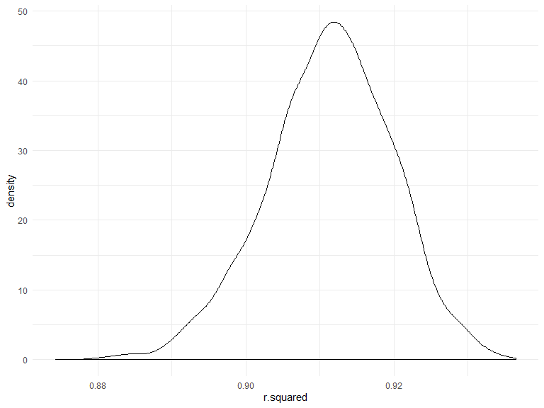

p8105\_hw6\_kq2127
================
Kristal Quispe
11/24/2019

# Problem 1

Load and clean the data set

``` r
bw_df =
  read_csv("./data/birthweight.csv") %>% 
  janitor::clean_names()%>% 
  mutate (
    babysex = as.factor(babysex),
    frace = as.factor(frace),
    malform = as.factor(malform),
    mrace = as.factor(mrace))
```

    ## Parsed with column specification:
    ## cols(
    ##   .default = col_double()
    ## )

    ## See spec(...) for full column specifications.

Checking for missing data

``` r
sum(is.na(bw_df))
```

    ## [1] 0

Fitting my model

``` r
my_model = lm(bwt ~ fincome + gaweeks + blength, data = bw_df)
```

The reason why my model includes gestational age in weeks is because its
an important predictor of a baby’s health and weight. The longer the
child was able to be in gestation, the bigger in weight it would be.
This is why premature babies are small and weigh very little, they have
a shorter gestational time then regular on schedule babies. Fincome was
added to my model because a babies family’s social economic status is a
predictor of access to health care and sufficient and quality nutrition
for moms during preganancy. Baby’s length is almost the same as baby’s
birth weight in the sense that if the baby developed ideally and had
proper nutrition and health then the baby would be longer.

Plot of Model Residuals against fitted values

``` r
bw_df %>% 
  modelr::add_residuals(my_model) %>% 
  modelr::add_predictions(my_model) %>% 
  ggplot(aes(x = pred, y = resid)) + 
  geom_point()
```



Other models

``` r
o1_model = lm(bwt ~ blength + gaweeks, data = bw_df)
o2_model = lm(bwt ~ bhead + blength + babysex + bhead * blength + bhead * babysex + blength * babysex + bhead * blength * babysex, data = bw_df)
```

Comparing other model

``` r
cv_df = 
  crossv_mc(bw_df, 100) %>% 
  mutate(
    train = map(train, as_tibble),
    test = map(test, as_tibble))
```

``` r
cv_results = 
  cv_df %>% 
  mutate(
    my_mod = map(.x = train, ~lm(bwt ~ fincome + gaweeks + blength, data = .x)),
    o1_mod = map(.x = train, ~lm(bwt ~ blength + gaweeks, data = .x)),
    o2_mod =  map(.x = train, ~lm(bwt ~ bhead + blength + babysex + bhead * blength + bhead * babysex + blength * babysex + bhead * blength * babysex, data = .x)),
    rmse_mymod = map2_dbl(.x = my_mod, .y = test, ~rmse(.x, .y)),
    rmse_o1mod = map2_dbl(.x = o1_mod, .y = test, ~rmse(.x, .y)),
    rmse_o2mod = map2_dbl(.x = o2_mod, .y = test, ~rmse(.x, .y))
  )
```

Visualize the root mean square error for the models

``` r
cv_results %>% 
  select(starts_with("rmse")) %>% 
  pivot_longer(
    everything(),
    names_to = "model", 
    values_to = "rmse",
    names_prefix = "rmse_") %>% 
  mutate(model = fct_inorder(model)) %>% 
  ggplot(aes(x = model, y = rmse)) + geom_violin()
```



# Problem 2

``` r
weather_df = 
  rnoaa::meteo_pull_monitors(
    c("USW00094728"),
    var = c("PRCP", "TMIN", "TMAX"), 
    date_min = "2017-01-01",
    date_max = "2017-12-31") %>%
  mutate(
    name = recode(id, USW00094728 = "CentralPark_NY"),
    tmin = tmin / 10,
    tmax = tmax / 10) %>%
  select(name, id, everything())
```

    ## Registered S3 method overwritten by 'crul':
    ##   method                 from
    ##   as.character.form_file httr

    ## Registered S3 method overwritten by 'hoardr':
    ##   method           from
    ##   print.cache_info httr

    ## file path:          C:\Users\kriqu\AppData\Local\rnoaa\rnoaa\Cache/ghcnd/USW00094728.dly

    ## file last updated:  2019-10-02 16:18:47

    ## file min/max dates: 1869-01-01 / 2019-09-30

linear model

``` r
pb_2 = lm(tmax ~ tmin, data = weather_df)

weather_df %>% 
  lm(tmax ~ tmin,data = .) %>% 
  broom::glance()
```

    ## # A tibble: 1 x 11
    ##   r.squared adj.r.squared sigma statistic   p.value    df logLik   AIC
    ##       <dbl>         <dbl> <dbl>     <dbl>     <dbl> <int>  <dbl> <dbl>
    ## 1     0.912         0.911  2.94     3741. 2.98e-193     2  -910. 1827.
    ## # ... with 3 more variables: BIC <dbl>, deviance <dbl>, df.residual <int>

``` r
weather_df %>% 
  lm(tmax ~ tmin,data = .) %>% 
  broom::tidy()
```

    ## # A tibble: 2 x 5
    ##   term        estimate std.error statistic   p.value
    ##   <chr>          <dbl>     <dbl>     <dbl>     <dbl>
    ## 1 (Intercept)     7.21    0.226       31.8 3.81e-107
    ## 2 tmin            1.04    0.0170      61.2 2.98e-193

Use 5000 bootstrap samples

``` r
boot_straps = 
  weather_df %>% 
  modelr::bootstrap(5000)
```

Log B0\*B1 estimates

``` r
bs_df1=
  weather_df %>% 
  modelr::bootstrap(n = 5000) %>% 
  mutate(
    models = map(strap, ~lm(tmax ~ tmin, data = .x) ),
    results = map(models, broom::tidy)) %>% 
  select(-strap, -models) %>% 
  unnest(results) %>% 
  select (.id, term, estimate) %>% 
  pivot_wider(
    names_from = term,
    values_from = estimate) %>% 
  rename(b0 = "(Intercept)") %>% 
  mutate (logb0b1 = log(b0*tmin)) 
```

Plotting the distribution

``` r
bs_df1%>% 
  ggplot(aes(x = logb0b1)) + 
  geom_density()
```



Identifying the the 2.5% and 97.5%

``` r
bs_df1%>%
  pull(logb0b1) %>% 
  quantile(probs = c(0.025, 0.975), na.rm =TRUE)
```

    ##     2.5%    97.5% 
    ## 1.965633 2.058469

r^2 estimates

``` r
bs_df2 =
  weather_df %>% 
  modelr::bootstrap(n = 5000) %>% 
  mutate(
    models = map(strap, ~lm(tmax ~ tmin, data = .x) ),
    results = map(models, broom::glance)) %>% 
  select(-strap, -models) %>% 
  unnest(results) %>% 
  select (.id, r.squared)
```

Plotting the distribution

``` r
bs_df2%>% 
  ggplot(aes(x = r.squared)) + 
  geom_density()
```



Identifying the the 2.5% and 97.5%

``` r
bs_df2%>%
  pull(r.squared) %>% 
  quantile(probs = c(0.025, 0.975), na.rm =TRUE)
```

    ##      2.5%     97.5% 
    ## 0.8934218 0.9271084
